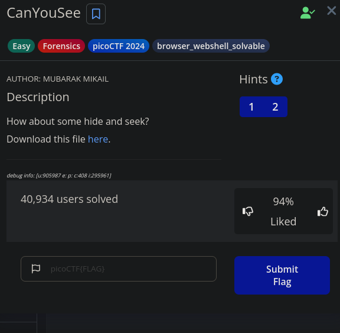
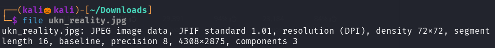
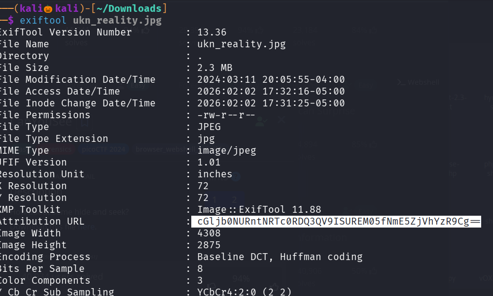
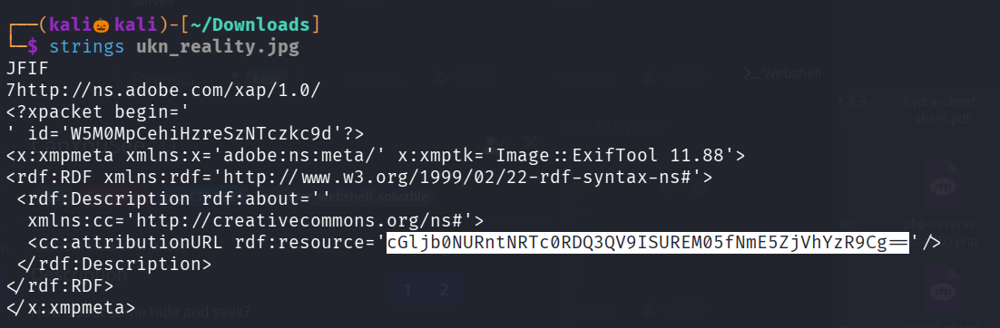

## CHALLENGE 

Click on the link and Download the Image 

lets use file command to see the image description 

now lets use exiftool to view the metadata of the image 

seems like the Attribution Url is base64 decoded 

lets verify it by using string command 

lets decode the base64 encoded string 

We successfully found the flag 

-------------------------------------------THE END----------------------------------------------------
