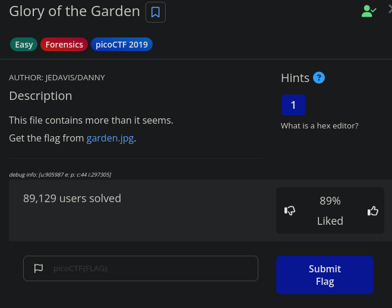
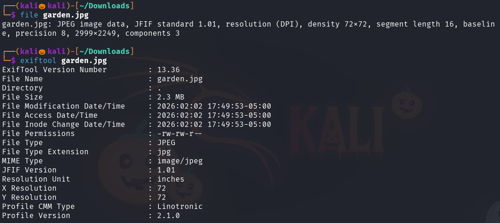
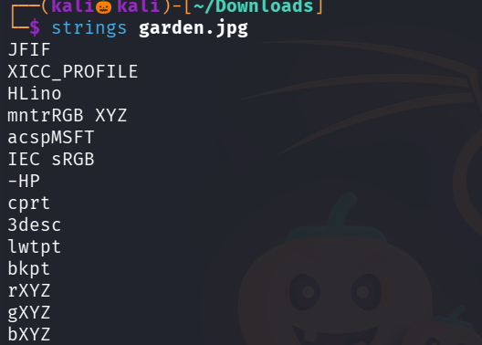
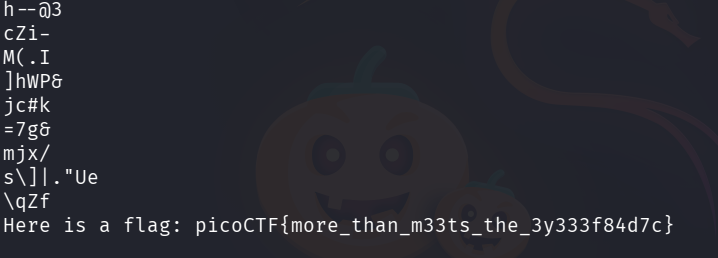
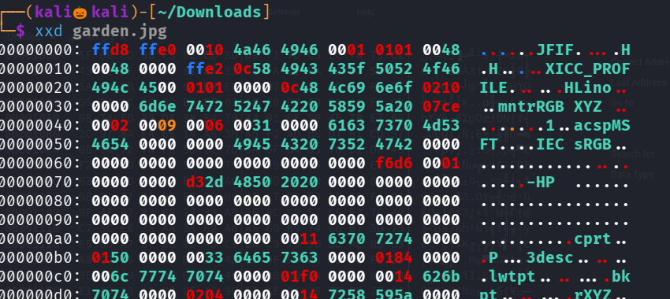
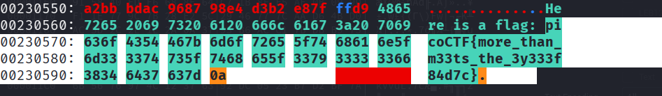

# CHALLENGE 

Lets download the image to our kali machine 

Now lets use file command to check the description of the image 

and exiftool to see the metadata of the file 

now lets use strings command to see the binary into human readable form of the image 

We successfully found the flag , since in the hint session they mentioned hex editor 

lets use xxd command to see the image in hex format 

We successfully got the flag 

--------------------------------------------------THE END--------------------------------------------------------------
