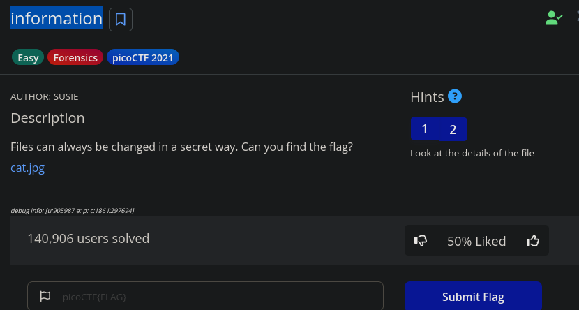
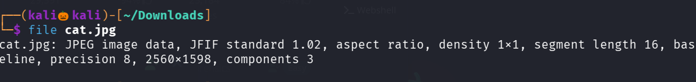
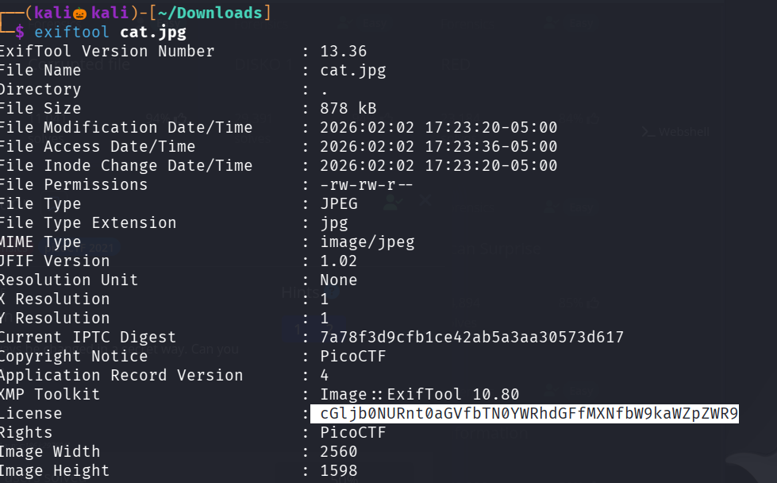
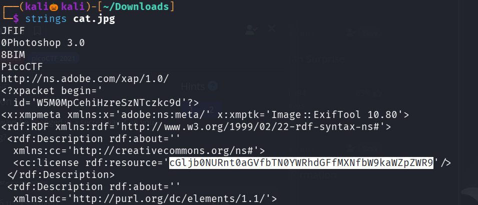
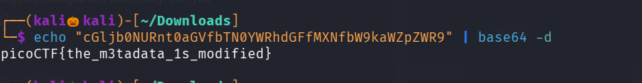

# CHALLENGE 

lets click on the link and download the image 

Now lets use file command to see the Description of the Image 

lets use exiftool to see the metadata of the Image 

seems like the license value has been encoded with base64

similary we can see the same value when using string command 

Lets decode the base64 encoded value 

We successfully found the flag 

--------------------------------------------------THE END------------------------------------------------------------
