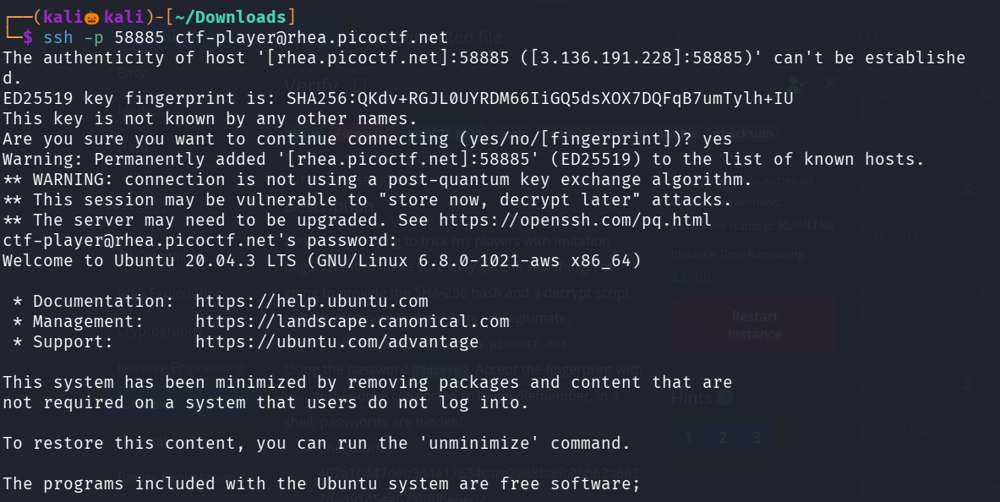
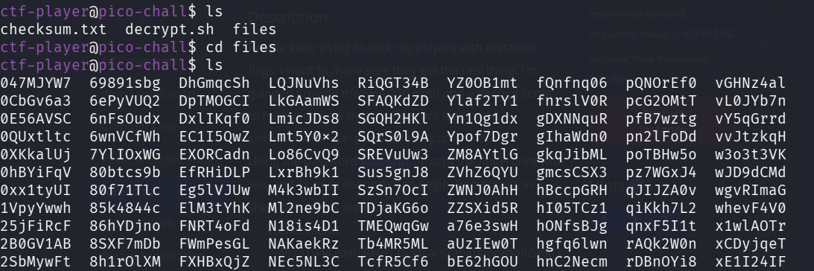
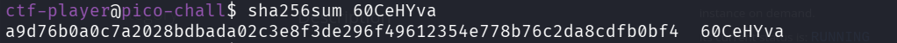
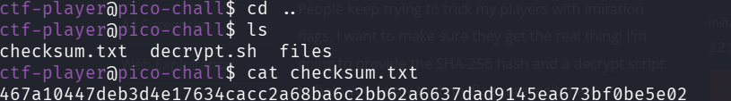
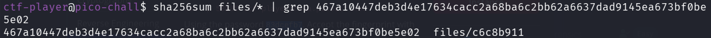
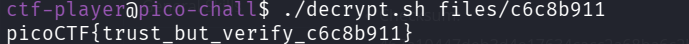

# CHALLENGE

Lets connect to the target using the username and password over ssh 

Lets list and anazyle the files 

seems like there is a file folder which contains lot of files , lets use 
command : sha256sum <file_name> to identify the checksum value of the file 

The file checksum value should match the checksum.txt file 

Lets use command : sha256sum files/* | grep <checksum> 

We found the files containing the same value as in checksum.txt

now lets decrupt the file using the code decrypt.sh 

We successfully found the flag
